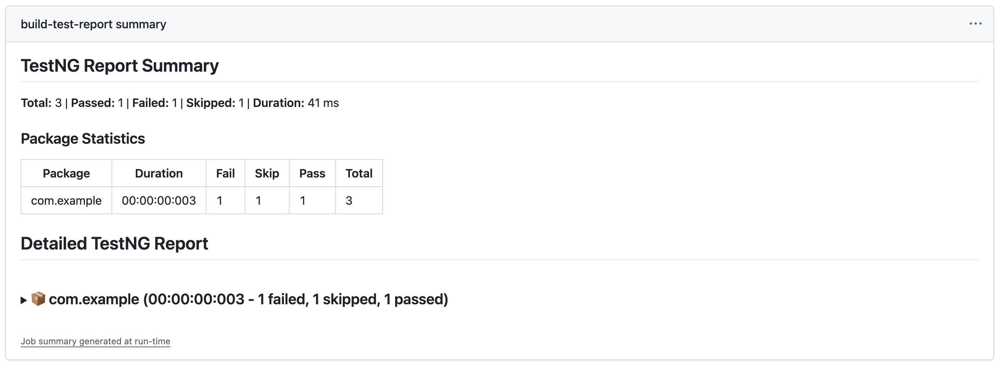

# TestNG Report Generator GitHub Action

[](https://github.com/runekit-oss/action-testng-report/actions/workflows/ci.yml)

A GitHub Action to parse TestNG XML result files, generate Markdown test reports, and annotate failed tests directly in pull requests.

---

## Features

- Parses TestNG XML result files (supports multiple suites)
- Generates GitHub workflow annotations for failed tests (with stack traces)
- Provides summary and detailed Markdown test reports in workflow summary
- Configurable via action inputs
- Fast, robust, and CI-friendly

---

## Quick Start

Add the following to your workflow to get started:

```yaml
jobs:
  testng-report:
    runs-on: ubuntu-latest
    steps:
      - name: Generate TestNG Report
        uses: runekit-oss/action-testng-report@v1
        with:
          summary_report: 'true'
          detailed_report: 'true'
          fail_if_empty: 'true'
```

---

## Inputs

| Name            | Description                                         | Default                     |
|-----------------|-----------------------------------------------------|-----------------------------|
| report_paths    | Glob for TestNG XML files                           | `**/testng-results.xml`     |
| summary_report  | Generate summary report (true/false)                | `true`                      |
| detailed_report | Generate detailed report (true/false)               | `false`                     |
| fail_if_empty   | Fail if no test results found (true/false)          | `true`                      |

---

## Example Output

**Summary Report:**




**Annotations:**


---

## Troubleshooting

- Ensure your TestNG XML files are generated and available at the specified `report_paths`.
- If no files are found, the action will fail if `fail_if_empty` is `true`.
- For custom locations, update the `report_paths` input.

---
